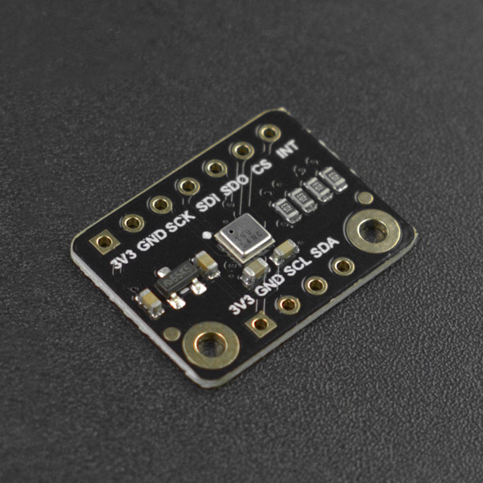

# DFRobot_RGBButton
* [English Version](./README.md)

RGB 按钮模块，一个带有rgb灯的漂亮彩色按钮。可以通过i2c设置RGB灯颜色和读取其按键状态，也可以直接通过中断引脚获取按键状态，地址拨码开关的存在，使得多个按钮可以级联。




## 产品链接 (https://www.dfrobot.com.cn/)
    SKU: DFR0991


## 目录

* [概述](#概述)
* [库安装](#库安装)
* [方法](#方法)
* [兼容性](#兼容性)
* [历史](#历史)
* [创作者](#创作者)


## 概述

* 系统自定义七种颜色，红橙黄绿青蓝紫；用户也可用rgb值自定义颜色
* 用户可根据配置PWM信号控制RGB灯的亮度，独立配置周期和脉宽
* I2C地址可根据拨码开关来设置
* 按键具有中断通知功能，正常状态为低电平，按键按下为高电平


## 库安装

要使用库, 首先下载库文件, 将其粘贴到指定的目录中, 然后打开examples文件夹并在该文件夹中运行演示。


## 方法

```python

    '''!
      @brief 初始化传感器
      @return  返回初始状态
      @retval True 表示初始化成功
      @retval False 表示初始化失败
    '''
    def begin(self):

    '''!
      @brief 设置七种基础颜色以及白黑(白黑对应亮灭) 或 用RGB值设置对应颜色
      @param color - 七种基础颜色以及白黑对应的值: 
      @n  e_red, e_orange, e_yellow, e_green, e_cyan, e_blue, e_purple, e_white, e_black
      @param r - 红灯的脉宽值
      @param g - 绿灯的脉宽值
      @param b - 蓝灯的脉宽值
    '''
    def set_RGB_color(self, color):
    def set_RGB_color(self, r, g, b):

    '''!
      @brief 获取模块按键状态
      @return 模块当前的按键状态:
      @retval   true - 按键按下
      @retval   false - 按键未按下
    '''
    def get_button_status(self):

```


## 兼容性

* RaspberryPi 版本

| Board        | Work Well | Work Wrong | Untested | Remarks |
| ------------ | :-------: | :--------: | :------: | ------- |
| RaspberryPi2 |           |            |    √     |         |
| RaspberryPi3 |           |            |    √     |         |
| RaspberryPi4 |     √     |            |          |         |

* Python 版本

| Python  | Work Well | Work Wrong | Untested | Remarks |
| ------- | :-------: | :--------: | :------: | ------- |
| Python2 |     √     |            |          |         |
| Python3 |     √     |            |          |         |


## 历史

- 2022/05/17 - 1.0.0 版本


## 创作者

Written by qsjhyy(yihuan.huang@dfrobot.com), 2022. (Welcome to our [website](https://www.dfrobot.com/))

